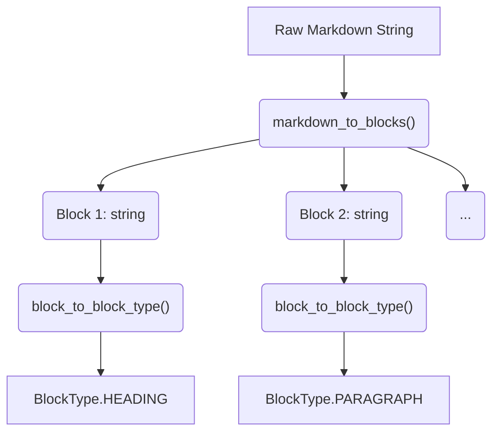
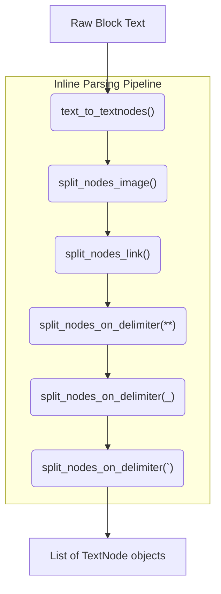
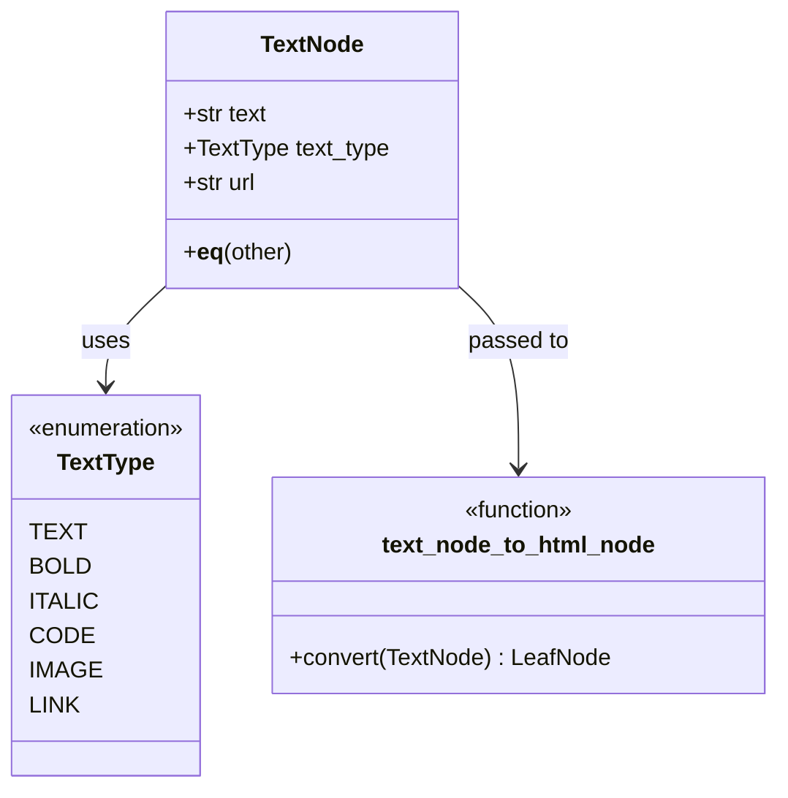
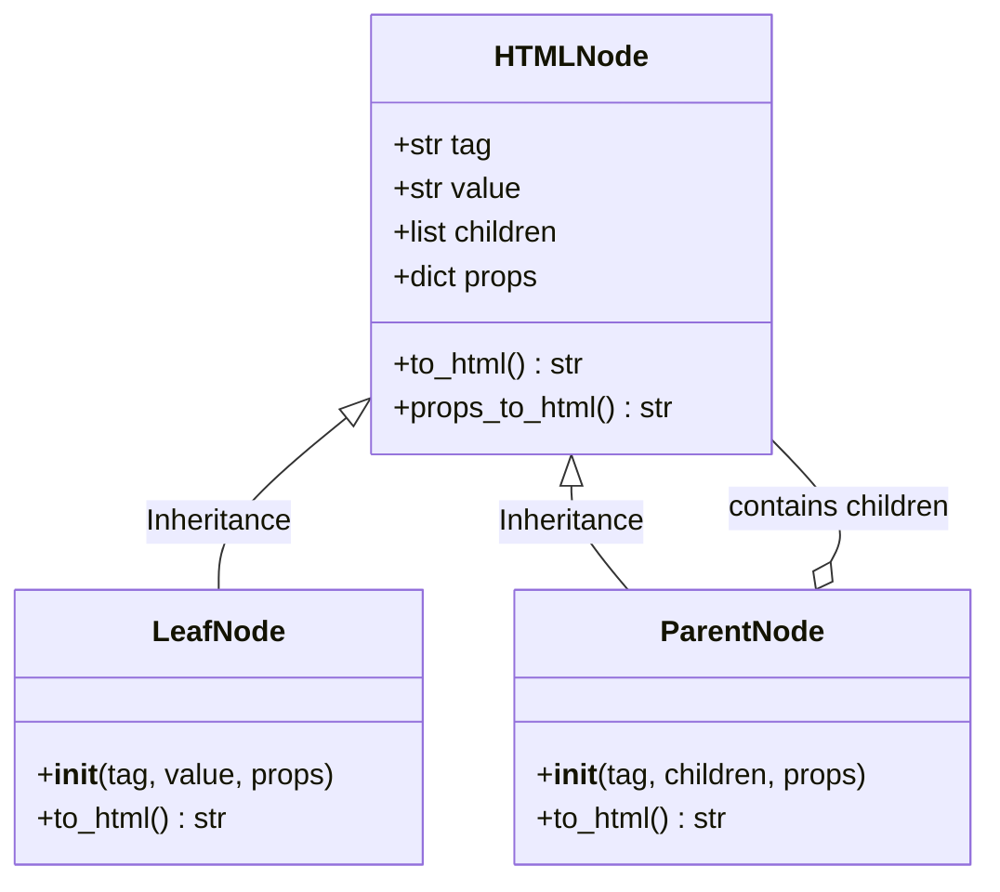
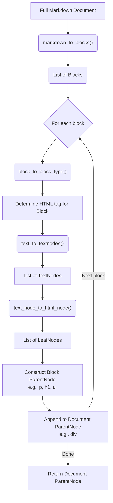
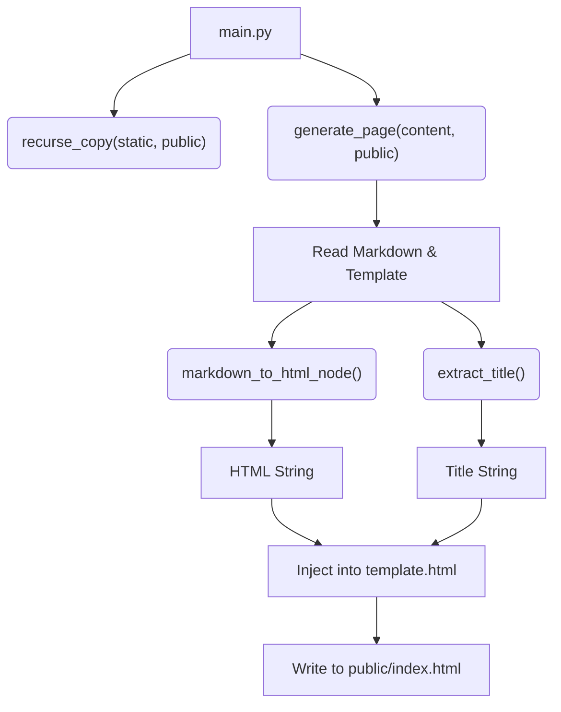

# Static Site Generator Architecture

This document describes the architectural flow of converting a full Markdown document into an HTML tree structure. The order of the sections follows the sequential logic of the conversion pipeline, culminating in the complete `HTMLNode` tree.

## 1. Block Level Parsing (`blocks.py`)

The first step in parsing a Markdown document is to split it into distinct block-level elements (e.g., paragraphs, headings, lists). 

*   **`markdown_to_blocks(markdown: str) -> list[str]`**: Takes the raw Markdown string, splits it by double newlines (`\n\n`), and strips leading/trailing whitespace to return a list of block strings.
*   **`block_to_block_type(block: str) -> BlockType`**: Analyzes a single Markdown block and categorizes it into an `Enum` value (`PARAGRAPH`, `HEADING`, `CODE`, `QUOTE`, `ULIST`, `OLIST`) based on its prefix (e.g., `# `, `> `, `- `).

## 2. Inline Text Parsing (`nodes.py`)

Once the Markdown is broken into manageable blocks, the internal text of each block (except for code blocks, typically) needs to be parsed for inline formatting like bold, italics, links, and images. 

*   **`text_to_textnodes(text: str) -> list[TextNode]`**: This is the orchestrator function. It takes a raw string (from a block) and passes it through a series of splitting functions.
*   **`split_nodes_image(...)` & `split_nodes_link(...)`**: Uses regular expressions (`extract_markdown_images`, `extract_markdown_links`) to split nodes based on markdown image and link syntax.
*   **`split_nodes_on_delimiter(...)`**: Handles text style boundaries like `**` (bold), `_` (italic), and `\`` (code).

## 3. TextNode Representation (`textnode.py`)

The output of the inline parsing phase is a list of `TextNode` objects. These serve as an intermediate representation of text with a specific formatting type.

*   **`TextNode`**: A class that stores the text content, its `TextType` (e.g., `TEXT`, `BOLD`, `ITALIC`, `CODE`, `LINK`, `IMAGE`), and an optional URL for links/images.
*   **`text_node_to_html_node(text_node: TextNode) -> LeafNode`**: This critical function bridges the gap between the Markdown intermediate representation (`TextNode`) and the final HTML representation (`LeafNode`). It maps text types to appropriate HTML tags (e.g., `BOLD` -> `<b>`, `ITALIC` -> `<i>`).

## 4. HTML Tree Construction (`htmlnode.py`)

The final goal of the pipeline is to construct a hierarchical tree of HTML nodes. This tree can then be serialized into a final HTML string.

*   **`HTMLNode`**: The base class for any node in the HTML tree. Stores the tag name, value, children nodes, and HTML attributes (`props`).
*   **`LeafNode`**: A subclass of `HTMLNode` that represents a terminal node (it has a value but no children). Examples include raw text, bold text segments, or image tags.
*   **`ParentNode`**: A subclass of `HTMLNode` that contains other `HTMLNode` objects (which can be `LeafNode`s or other `ParentNode`s) but no direct value itself. Examples include `
`, `
`, `<ul>`.

## 5. Tying It All Together (`src/markdown.py`)

The `markdown.py` module contains the master wrapper function `markdown_to_html_node(markdown)`. It utilizes all the components described above to produce the final HTML document tree.

### Execution Flow for `markdown_to_html_node`:

1.  Call `markdown_to_blocks` on the full document.
2.  Create a top-level `ParentNode` representing the `
` wrapper for the whole document.
3.  Iterate over each block:
    *   Determine the block's type using `block_to_block_type`.
    *   Strip out syntax markers from the block (e.g., remove `# ` for headings, `> ` for quotes).
    *   Pass the cleaned text to `text_to_textnodes` to get a list of inline `TextNode`s.
    *   Convert each `TextNode` into a `LeafNode` using `text_node_to_html_node`.
    *   Create a `ParentNode` for the block itself (e.g., `
`, `<h1>`, `<ul>`) and attach the `LeafNode`s as children.
    *   Append this block's `ParentNode` to the top-level document `ParentNode`.

## 6. Site Orchestration & Generation (`main.py`, `generate_site.py`, `copystatic.py`)

The final piece of the application is the actual pipeline that recursively processes an entire content directory and builds the public website.

*   **`main.py`**: The entrypoint script. It orchestrates the process by clearing the `public` directory, copying static assets, and triggering the markdown-to-HTML generation.
*   **`copystatic.py`**: Provides the `recurse_copy` function to safely duplicate all images, CSS, and other static assets from the `static` folder into the `public` destination directory.
*   **`generate_site.py`**: Provides `generate_page` and `extract_title`. It reads a source Markdown file, uses `markdown_to_html_node` to parse the content into an HTML tree, extracts the `# Title`, and injects the resulting HTML into a standard `template.html` file before saving it to the destination path.

